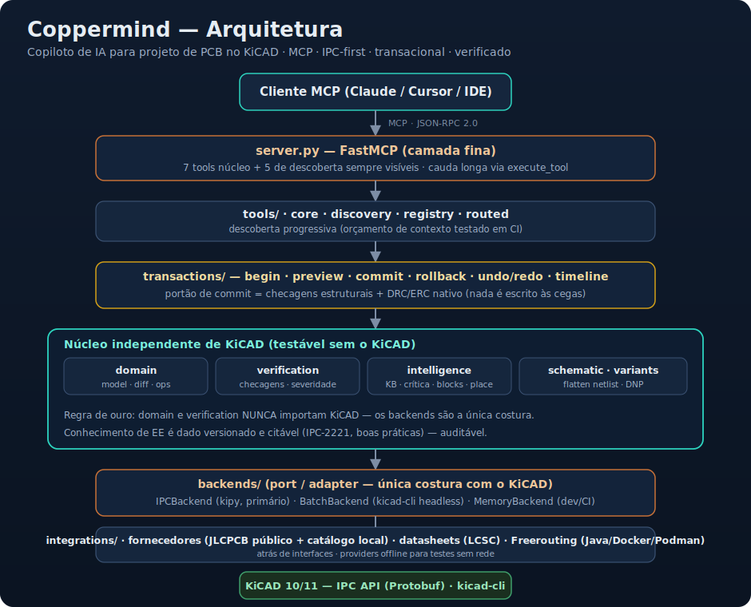
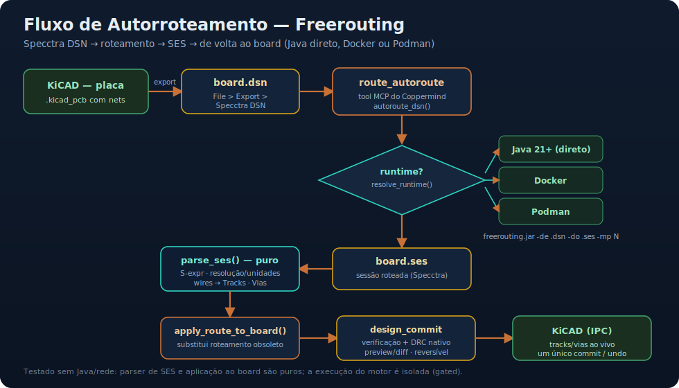

<div align="center">

# 🔶 Coppermind

### Copiloto de IA para projeto de PCB no KiCAD — servidor MCP **IPC-first, transacional e verificado**

[](LICENSE)
[](https://www.python.org/)
[](https://www.kicad.org/)
[](#-qualidade-testes-e-ci)
[](https://modelcontextprotocol.io/)

**🇧🇷 Português (principal)** · [🇺🇸 English](README.en.md)

</div>

---

> **Descreva o que você quer projetar.** O Coppermind propõe, **verifica**,
> **explica** e só então aplica — e **tudo é reversível**.

O Coppermind é um servidor [MCP](https://modelcontextprotocol.io/) que permite a
assistentes de IA (como o Claude) projetarem PCBs no KiCAD por **linguagem
natural**. Diferente de um tradutor fino de comandos, ele **pré-visualiza e
verifica cada alteração antes de gravar** (incluindo DRC/ERC nativo do KiCAD),
mantém tudo **reversível** e fundamenta suas sugestões numa **base de
conhecimento de engenharia elétrica citável**.

<div align="center">



</div>

---

## 📑 Sumário

- [Por que o Coppermind existe](#-por-que-o-coppermind-existe)
- [O que o torna diferente](#-o-que-o-torna-diferente)
- [Arquitetura](#-arquitetura)
- [Como funciona o modelo transacional](#-como-funciona-o-modelo-transacional)
- [Instalação](#-instalação)
- [Configuração no cliente MCP](#-configuração-no-cliente-mcp)
- [Backends](#-backends)
- [Catálogo de ferramentas (tools)](#-catálogo-de-ferramentas-tools)
- [Inteligência de design](#-inteligência-de-design)
- [Autorroteamento (Freerouting)](#-autorroteamento-freerouting)
- [Fornecedores (JLCPCB/LCSC) e datasheets](#-fornecedores-jlcpcblcsc-e-datasheets)
- [Exemplos de uso](#-exemplos-de-uso)
- [Qualidade: testes e CI](#-qualidade-testes-e-ci)
- [Estrutura do projeto](#-estrutura-do-projeto)
- [Roadmap / status das fases](#-roadmap--status-das-fases)
- [Limitações honestas](#-limitações-honestas)
- [Contribuindo](#-contribuindo)
- [Licença, créditos e aviso](#-licença-créditos-e-aviso)

---

## 🎯 Por que o Coppermind existe

O projeto nasceu do **estudo crítico** de servidores MCP de KiCAD existentes (em
especial o `mixelpixx/KiCAD-MCP-Server`). Eles provaram a demanda, mas tinham
fraquezas recorrentes: documentação contraditória, um "router" de tools anunciado
mas inerte, ponte TypeScript↔Python frágil, dependência forte do SWIG (`pcbnew`)
— que o **KiCAD 11 remove** — e designs gerados por IA **sem verificação
obrigatória**.

O Coppermind corrige cada uma dessas falhas por construção e vai além: transforma
um *executor de comandos* num **copiloto de engenharia** que raciocina sobre o
projeto, valida continuamente e mantém o humano no controle.

> 📄 A análise completa e as decisões de arquitetura estão em
> [`docs/ARQUITETURA.md`](docs/ARQUITETURA.md).

---

## ✨ O que o torna diferente

| Pilar | O que significa na prática |
| --- | --- |
| 🔌 **IPC-first** | Construído sobre a API IPC (Protobuf) do KiCAD via `kicad-python` (kipy) — o caminho que **sobrevive ao KiCAD 11**, onde o SWIG é removido. O SWIG nunca é a fundação. |
| 🐍 **Uma linguagem** | Python puro com o SDK oficial de MCP (FastMCP). Sem ponte TS↔Python e seus modos de falha. |
| 🛡️ **Nada é escrito às cegas** | Toda mutação passa por uma transação: `preview` (diff + render) → `verify` → `commit`/`rollback`, com `undo`/`redo`. |
| ✅ **Verificação no caminho feliz** | Checagens estruturais bloqueiam commits inválidos; o **DRC/ERC nativo do KiCAD entra no mesmo portão**; cada achado cita sua regra. |
| 🧪 **Núcleo independente de KiCAD** | Domínio + verificação + transações rodam e são **testados sem o KiCAD**. |
| 🔎 **Descoberta progressiva real** | Conjunto enxuto sempre visível; a cauda longa é descoberta sob demanda. Um **teste de orçamento de contexto** no CI garante isso — não é slogan. |
| 🧠 **Inteligência de design** | Base de conhecimento de EE **versionada e citável** (largura por IPC-2221, desacoplamento por CI…) move crítica proativa e *design blocks* — cada sugestão aponta para sua regra. |
| 🤝 **Colaboração & integrações plugáveis** | Linha do tempo versionada, modo "explique", fornecedores (JLCPCB/LCSC) e autorouter Freerouting — atrás de interfaces, com providers offline testáveis. |

---

## 🏗️ Arquitetura

O sistema é organizado em **camadas com fronteiras nítidas**. A **regra de ouro**:
`domain/` e `verification/` **nunca** importam o KiCAD — os backends são a única
costura. Isso permite testar inteligência e verificação sem o KiCAD e trocar o
backend (IPC hoje, IPC-only amanhã) sem tocar na lógica.


| Camada | Pasta | Responsabilidade |
| --- | --- | --- |
| Protocolo | `server.py` | Registro de tools/resources via FastMCP (camada fina) |
| Ferramentas | `tools/` | `core` · `discovery` · `registry` · `routed` |
| Orquestração | `transactions/` | begin/preview/commit/rollback, undo/redo, timeline |
| Domínio | `domain/` | modelo de placa, diff, operações (sem KiCAD) |
| Verificação | `verification/` | checagens estruturais + severidade (sem KiCAD) |
| Inteligência | `intelligence/` | KB de EE, crítica, design blocks, placement |
| Esquemático | `schematic/` | folhas hierárquicas + flatten de netlist |
| Variantes | `variants.py` | overrides por componente (valor/footprint/DNP) |
| Backends | `backends/` | IPC (kipy) · Batch (kicad-cli) · Memory (dev/CI) |
| Integrações | `integrations/` | fornecedores · datasheets · Freerouting |

---

## 🔁 Como funciona o modelo transacional

Toda alteração segue o ciclo:

```
begin → (aplica na cópia de trabalho) → preview → verify → commit | rollback
```

- **preview** retorna um **diff estruturado**, um **render**, as **violações**
  (estruturais + DRC nativo) e os **conselhos** de design (citados).
- **commit** roda o **portão de verificação**. Se houver violação de nível
  *erro*, o commit é **bloqueado** e a cópia de trabalho fica intacta para correção.
- Cada commit bem-sucedido entra na **linha do tempo** e permite **undo/redo**.

Resultado: é **estruturalmente impossível** gravar muitos estados inválidos sem aviso.

---

## 📦 Instalação

Requisitos: **Python 3.11+**, e (para uso ao vivo) **KiCAD 10+** com a API IPC
habilitada. Node não é necessário.

```bash
git clone https://github.com/charlesmmorais/coppermind.git
cd coppermind

# ambiente de desenvolvimento (roda a suíte inteira SEM precisar de KiCAD)
pip install -e ".[dev]"
pytest

# uso real (servidor MCP) — adicione o extra [ipc] para KiCAD ao vivo
pip install -e ".[ipc]"
coppermind          # ou: python -m coppermind.server
```

Seleção de backend por variável de ambiente:

```bash
COPPERMIND_BACKEND=auto    # IPC se o KiCAD estiver acessível, senão memória (padrão)
COPPERMIND_BACKEND=ipc     # exige KiCAD ao vivo
COPPERMIND_BACKEND=memory  # sempre em memória (dev/offline)
```

---

## ⚙️ Configuração no cliente MCP

Exemplo para **Claude Desktop** (`claude_desktop_config.json`):

```json
{
  "mcpServers": {
    "coppermind": {
      "command": "coppermind",
      "env": { "COPPERMIND_BACKEND": "auto", "LOG_LEVEL": "info" }
    }
  }
}
```

No KiCAD, habilite a API IPC em **Preferences → Plugins → Enable IPC API Server**.

---

## 🧩 Backends

| Backend | Precisa de | load/apply | render | DRC nativo |
| --- | --- | --- | --- | --- |
| `MemoryBackend` | nada | sim (em memória) | SVG | — |
| `IPCBackend` | KiCAD rodando (ou `headless=True`) | sim (kipy) | SVG do KiCAD | via kicad-cli |
| `BatchBackend` | `kicad-cli` + um `.kicad_pcb` | (fase futura) | SVG do KiCAD | via kicad-cli |

A ordem de auto-detecção é **IPC → memória**. O `BatchBackend` é específico para
arquivos e usado para DRC/render headless.

---

## 🛠️ Catálogo de ferramentas (tools)

**41 tools** no total: **7 núcleo** + **5 de descoberta** sempre visíveis, e
**29 roteadas** descobertas sob demanda (organizadas em 8 categorias).

### Sempre visíveis — núcleo
`project_create` · `component_place` · `net_create` · `net_route` ·
`design_preview` · `design_commit` · `design_rollback`

### Sempre visíveis — descoberta progressiva
`list_tool_categories` · `get_category_tools` · `search_tools` ·
`get_tool_schema` · `execute_tool`

### Roteadas (sob demanda), por categoria

| Categoria | Tools |
| --- | --- |
| `component` | `component_move`, `component_edit`, `component_delete`, `component_list` |
| `net` | `net_list` |
| `board` | `board_info` |
| `design` | `design_undo`, `design_redo`, `design_render`, `design_critique`, `design_list_rules`, `design_explain_rule`, `design_add_decoupling`, `design_add_led`, `design_timeline`, `design_explain`, `design_placement_report` |
| `supplier` | `supplier_search`, `supplier_part`, `supplier_alternatives`, `supplier_cheapest` |
| `datasheet` | `datasheet_get`, `datasheet_enrich` |
| `routing` | `route_check`, `route_export_dsn`, `route_autoroute`, `route_import_ses` |
| `variant` | `variant_preview`, `variant_apply` |

> 💡 **Por que isso importa:** carregar 41 schemas em todo turno desperdiça
> contexto e degrada a seleção do modelo. O Coppermind mantém o conjunto visível
> enxuto e expõe o resto via `search_tools`/`execute_tool` — e um **teste de CI
> falha** se alguém estourar o orçamento.

---

## 🧠 Inteligência de design

O que transforma "executor" em "copiloto" (tudo em `intelligence/`, sem KiCAD):

- **Base de conhecimento de EE versionada e citável** (`knowledge.py`): cada regra
  tem id estável, citação (ex.: **IPC-2221**) e racional. Um teste de governança
  garante ids únicos e que toda regra cita uma fonte.
- **Calculador IPC-2221** (`trace_width.py`): largura mínima de trilha por
  corrente, validado contra tabelas conhecidas (1 A ≈ 0,30 mm, 1 oz, ΔT 10 °C).
- **Crítica proativa** (`critique.py`): largura de trilha de potência,
  desacoplamento por CI, presença de GND — **conselhos** que **nunca bloqueiam**
  o commit, cada um citando sua regra. Aparecem como `advice` no `design_preview`.
- **Design blocks parametrizáveis** (`blocks.py`): capacitor de desacoplamento,
  indicador LED+resistor — cada um retorna um `BlockResult` justificado.

```text
"Adicione um capacitor de desacoplamento ao U1"
→ design_add_decoupling(U1, C1)  →  a crítica de "U1 sem desacoplamento" some
```

---

## 🔀 Autorroteamento (Freerouting)

Fluxo completo **Specctra DSN → SES → placa**, com runtime **Java direto,
Docker ou Podman** (auto-detecção nessa ordem).



👉 **Passo a passo completo:** [`docs/AUTORROTEAMENTO.md`](docs/AUTORROTEAMENTO.md)
(exportar o DSN do KiCAD, baixar o jar / usar Docker, rodar `route_autoroute`).

Resumo:

```text
route_check                              # runtime + jar prontos?
# exporte o DSN no KiCAD: File → Export → Specctra DSN
route_autoroute  dsn_path=... ses_path=...   # roteia e importa
design_preview                           # revise (diff + DRC + render)
design_commit                            # grava (ou design_rollback)
```

O **parser de SES** (S-expression, ciente de resolução/unidades) e a aplicação ao
board são **puros e testados sem Java**; só a execução do motor é isolada.

---

## 🛒 Fornecedores (JLCPCB/LCSC) e datasheets

Dois modos JLCPCB, atrás da mesma interface `SupplierProvider`:

1. **API pública sem credenciais** — `JLCPCBProvider` (via JLCSearch), parser puro
   testado.
2. **Catálogo local** — `LocalLibraryProvider` sobre o **SQLite do `jlcparts`**
   (catálogo de **2,5M+ peças**), com busca/preço/estoque/Basic/datasheet —
   **testado ponta a ponta** (SQLite é local, sem rede).

Mais **otimização de custo ciente da taxa Básico/Estendido** do JLCPCB
(`pick_cheapest`): em baixa quantidade, a parte Básica vence (sem taxa de US$3);
em alto volume, o volume amortiza a taxa.

**Enriquecimento de datasheet via LCSC** (`integrations/datasheets.py`): resolve
URLs de datasheet por id LCSC ou para um BOM via o provider ativo, com um cliente
LCSC direto (parser de resposta puro e testado) como fallback.

```text
supplier_cheapest  query="10k 0603"  qty=100
datasheet_enrich   bom={ "R1": "C25804", "R2": "C22775" }
```

---

## 💬 Exemplos de uso

Tudo em linguagem natural para o assistente:

```text
Crie um projeto 'LEDBoard' de 50x50mm.
Coloque um LED em 10,10 e um resistor de 330Ω em 20,10.
Crie a net 'LED1' e roteie de R1 até o LED com 0,3mm.
Mostre o preview e os conselhos de design.
Se estiver ok, faça o commit como "primeiro LED".
```

```text
Procure um resistor 10k 0603 Básico mais barato para 100 unidades.
Aplique a variante de baixo custo: R1 = 22k, R2 = DNP.
Rode o autorouter e me mostre o que mudou antes de gravar.
```

---

## 🔬 Qualidade: testes e CI

- **132 testes** passando, **todos sem KiCAD nem rede**. As chamadas ao vivo
  (IPC/CLI/rede/motor externo) ficam isoladas e marcadas `# pragma: no cover`,
  cobertas pelo job de **integração** do CI (KiCAD 10 + Java headless).
- **Invariantes verificadas por CI**, não prometidas:
  - 🧮 **orçamento de contexto**: falha se o conjunto visível de tools crescer demais;
  - 📚 **governança da KB**: toda regra precisa de id único, citação e racional;
  - 🚫 **SWIG-free** (prontidão KiCAD 11): falha se qualquer módulo importar `pcbnew`.

```bash
pytest                 # suíte completa (sem KiCAD)
ruff check src tests   # lint
mypy src               # tipagem
```

---

## 🗂️ Estrutura do projeto

```
coppermind/
├── README.md                  # este arquivo (pt-BR, principal)
├── README.en.md               # versão em inglês
├── LICENSE                    # MIT
├── pyproject.toml
├── docs/
│   ├── ARQUITETURA.md         # documento de arquitetura/decisões
│   ├── AUTORROTEAMENTO.md     # guia passo a passo do Freerouting
│   ├── architecture.svg       # diagrama de arquitetura
│   └── freerouting-flow.svg   # diagrama do fluxo de autorroteamento
├── src/coppermind/
│   ├── server.py · session.py
│   ├── domain/                # modelo, diff, operações (sem KiCAD)
│   ├── verification/          # checagens estruturais
│   ├── transactions/          # transações + timeline
│   ├── intelligence/          # KB, crítica, blocks, placement, explain
│   ├── schematic/             # hierarquia + flatten de netlist
│   ├── variants.py
│   ├── backends/              # IPC · Batch · Memory · DRC · units · mapping
│   ├── integrations/          # suppliers · datasheets · freerouting
│   └── tools/                 # core · discovery · registry · routed
├── tests/                     # 132 testes (sem KiCAD)
└── .github/workflows/ci.yml   # core (sem KiCAD) + integração (KiCAD+Java)
```

---

## 🧭 Roadmap / status das fases

| Fase | Tema | Status |
| --- | --- | --- |
| 0 | Fundação: domínio, transações, backends, núcleo de tools, CI | ✅ |
| 1 | Verificação no loop: IPC real, BatchBackend, DRC/ERC nativo, render | ✅ |
| 2 | Descoberta progressiva real + edições in-place no `plan_apply` | ✅ |
| 3 | Inteligência de design: KB citável, IPC-2221, crítica, blocks | ✅ |
| 4 | Colaboração & integrações: timeline, explain, fornecedores, autorouter | ✅ |
| 5 | Maturidade: schematic hierárquico, variantes, placement, prontidão KiCAD 11 | ✅ |

---

## ⚠️ Limitações honestas

- **Colocação de footprint de biblioteca ao vivo** depende de uma API estável do
  kipy para buscar a *definição* do footprint — inexistente no kipy 0.7 / KiCAD 10.
  O Coppermind já **modela** isso no plano puro e tenta a colocação, registrando o
  que não resolver.
- **Modificar/remover trilhas ao vivo** precisa de um mapa estável de item-id;
  hoje só **adições** de trilha são empurradas ao vivo (o plano puro já cobre o resto).
- A **API oficial `api.jlcpcb.com/Components`** exige credenciais enterprise — por
  isso o modo "sem credenciais" usa o JLCSearch, e o catálogo local cobre os 2,5M+
  offline.

---

## 🤝 Contribuindo

Contribuições são bem-vindas! Sugestão de fluxo:

1. Abra uma *issue* descrevendo bug/ideia (com passos de reprodução).
2. *Fork* → branch de feature → mantenha o estilo (ruff/mypy) → **adicione testes**.
3. Garanta `pytest`, `ruff check` e `mypy src` verdes.
4. Abra o PR com descrição clara.

Princípio inegociável: **o núcleo permanece independente de KiCAD e testável**.

---

## 📜 Licença, créditos e aviso

Licenciado sob **MIT** — veja [LICENSE](LICENSE).

**Créditos:** [Model Context Protocol](https://modelcontextprotocol.io/) (Anthropic),
[KiCAD](https://www.kicad.org/), [kicad-python](https://docs.kicad.org/kicad-python-main/),
[Freerouting](https://github.com/freerouting/freerouting),
[jlcparts](https://github.com/yaqwsx/jlcparts) e
[JLCSearch](https://jlcsearch.tscircuit.com/).

