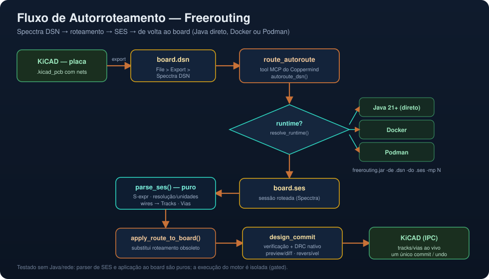

# Guia de Autorroteamento (Freerouting)

Este guia mostra, passo a passo, como rotear automaticamente uma PCB no fluxo do
Coppermind usando o [Freerouting](https://github.com/freerouting/freerouting) —
do export do DSN no KiCad até aplicar o resultado na placa.



O Coppermind usa o formato **Specctra**: exporta-se um `.dsn`, o Freerouting
roteia e gera um `.ses`, e o Coppermind importa o `.ses` de volta como trilhas e
vias — tudo dentro de uma transação reversível (preview/diff/commit).

O fluxo é independente do transport MCP: funciona tanto via `stdio` quanto via
Streamable HTTP. Para configuração de cliente/túnel, veja
[TRANSPORTES.md](TRANSPORTES.md).

---

## Pré-requisitos

| Requisito | Por quê |
| --- | --- |
| KiCad 10+ | exportar o Specctra DSN da sua placa |
| `freerouting.jar` (v2) **ou** Docker/Podman | executar o autorouter |
| Java 21+ (só se rodar o jar direto, sem container) | runtime do Freerouting |
| Coppermind com extras IPC (`pip install -e ".[ipc]"`) | orquestrar o fluxo e conversar com KiCad quando disponível |

O Coppermind detecta o runtime automaticamente, **nesta ordem**: Java local →
Docker → Podman. Confira a qualquer momento com a tool `route_check`.

---

## Passo 1 — Exportar o DSN do KiCad

O `kicad-cli` **não** exporta Specctra DSN, então o export é feito pela interface
do KiCad (PCB Editor):

1. Abra sua placa no **PCB Editor** do KiCad.
2. Menu **File → Export → Specctra DSN…**
3. Salve como, por exemplo, `~/projetos/minha_placa/board.dsn`.

> Dica: garanta que os nets e footprints já estão definidos (faça o
> *Update PCB from Schematic*, F8, antes de exportar).

---

## Passo 2 — Obter o Freerouting

Escolha **uma** das opções abaixo.

### Opção A — Docker (recomendada, sem instalar Java)

```bash
docker pull eclipse-temurin:21-jre
mkdir -p ~/.kicad-mcp
curl -L -o ~/.kicad-mcp/freerouting.jar \
  https://github.com/freerouting/freerouting/releases/download/v2.1.0/freerouting-2.1.0.jar
```

### Opção B — Java direto

```bash
# Ubuntu/Debian
sudo apt install -y openjdk-21-jre-headless
mkdir -p ~/.kicad-mcp
curl -L -o ~/.kicad-mcp/freerouting.jar \
  https://github.com/freerouting/freerouting/releases/download/v2.1.0/freerouting-2.1.0.jar
```

### Opção C — Podman

Igual ao Docker; o Coppermind usa o Podman automaticamente se o Docker não estiver
disponível.

> Ajuste a URL/versão do `.jar` conforme a *release* mais recente do Freerouting.

---

## Passo 3 — Verificar a prontidão

Peça ao assistente (ou chame a tool diretamente):

```text
route_check
```

Resposta típica quando tudo está pronto:

```json
{ "runtime": "docker", "detail": "docker fallback", "jar_present": true, "ready": true }
```

Se `ready` for `false`, falta o runtime (Java/Docker/Podman) ou o `.jar` no caminho
informado.

---

## Passo 4 — Rodar o autorroteamento

Com a placa aberta no Coppermind e o `.dsn` exportado:

```text
route_autoroute
  dsn_path = ~/projetos/minha_placa/board.dsn
  ses_path = ~/projetos/minha_placa/board.ses
  jar_path = ~/.kicad-mcp/freerouting.jar   # padrão; pode omitir
  max_passes = 10
```

O Coppermind:

1. resolve o runtime (Java/Docker/Podman) e monta o comando do Freerouting;
2. executa o motor e aguarda o `.ses`;
3. faz o **parse do SES** respeitando resolução/unidades;
4. aplica trilhas/vias ao *working board*, sem commit automático.

Retorno típico:

```json
{ "ok": true, "tracks": 128, "vias": 14, "pending_commit": true }
```

---

## Passo 5 — Revisar e confirmar

Nada foi gravado ainda — reveja antes de aceitar:

```text
design_preview     # diff + DRC/ERC + render + advice
design_commit      # verifica e grava; bloqueia em erros
# ou
design_rollback    # descarta o resultado
```

O commit roda o portão de verificação. Se houver violação de nível erro, o commit é
**bloqueado** e o estado de trabalho fica disponível para correção.

---

## Alternativa — Importar um SES existente

```text
route_import_ses
  ses_path = ~/projetos/minha_placa/board.ses
  replace  = true
```

---

## Solução de problemas

| Sintoma | Causa provável | Solução |
| --- | --- | --- |
| `route_check` → `ready:false` | sem Java/Docker/Podman ou jar ausente | instale o runtime / baixe o `.jar` |
| "Freerouting is not available" | idem | rode `route_check` e corrija |
| `.ses` vazio / poucas trilhas | DSN sem nets/regras | refaça o export após F8 no KiCad |
| Trilhas em posição errada | unidade/resolução do SES | confirme a resolução do DSN/SES de origem |
| Quero ver o que mudou | — | use `design_preview` antes de `design_commit` |

---

## Referência rápida das tools

| Tool | O que faz |
| --- | --- |
| `route_check` | informa runtime e presença do jar |
| `route_export_dsn` | tenta exportar DSN via backend disponível; senão orienta o export manual |
| `route_autoroute` | DSN → Freerouting → SES → aplica ao board |
| `route_import_ses` | importa um `.ses` já roteado |
| `design_preview` / `design_commit` / `design_rollback` | revisar e confirmar/descartar |

Veja também o [README](../README.md), o [índice de documentação](README.md) e a
[arquitetura](ARQUITETURA.md).
