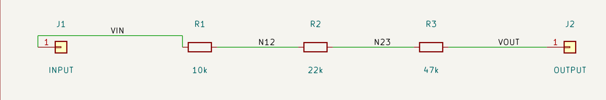
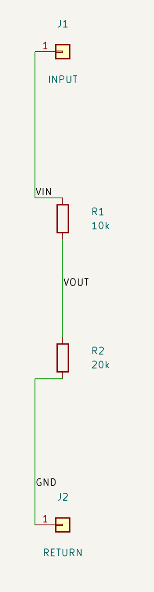
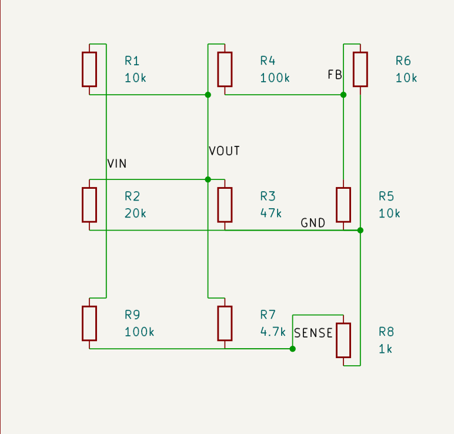

# PR #20 — orientação e clearance visual

**As colisões registradas na revisão anterior foram corrigidas.** Revisão dos
SVGs exportados pelo KiCad 10 sobre o commit `c714422e6549fe3b19ba2742445e27308a277a2b`.
O PR permanece Draft, aguardando o aceite local de Charles no Eeschema antes do merge.

[CI da correção](https://github.com/charlesmmorais/coppermind/actions/runs/34765522106)
— integração KiCad: 10 testes passaram, 1 foi ignorado.
[Artefato flow-visual-review](https://github.com/charlesmmorais/coppermind/actions/runs/34765522106/artifacts/10320096683)
contém os esquemas reais, SVGs, netlists e `comparison.json`.

As imagens são recortes dos SVGs reais da CI, renderizados com MuPDF; não são
screenshots do Windows de Charles. A [revisão anterior](before-clearance.md),
com as colisões originais, foi preservada para comparação.

## O que mudou

- O roteador considera os corpos desenhados na biblioteca real, com transformação
  de coordenadas e rotação. Unit 0 continua compartilhada; os anchors dos pins
  não são arredondados para a grade.
- Candidatos podem sair pelo eixo real do pin antes de procurar um trunk. Faixas
  próximas às bordas dos corpos evitam desvios grandes desnecessários.
- Reference/Value visíveis entram no custo do roteamento e nas faixas candidatas,
  inclusive os campos de componentes vizinhos ao alvo.
- A caixa de proteção de labels inclui o corpo gráfico real de J2, antes ausente
  na estimativa baseada apenas no pin. Labels continuam ancorados no próprio fio;
  uma net não pode ser seguida através de um crossing com outra net.
- `WIRE_SYMBOL_BODY_CONTACT` bloqueia contatos de fios com corpos. A validação
  retorna também `visual_violations`, incluindo `LABEL_CLEARANCE_COLLISION` quando
  não há candidato livre para o label. O score de campos considera distância,
  mas sua aproximação não substitui a inspeção visual.
- Crossings ortogonais interior/interior continuam permitidos. T-contact, overlap,
  contato com pin estrangeiro e crossing sobre junction elétrica continuam bloqueados.

## Resultado dos cenários

| Cenário | Orientação | Comprimento antes → depois da orientação | Preservação |
| --- | --- | --- | --- |
| Cadeia horizontal | R1/R2/R3: 90° | Conectividade exata confirmada no KiCad | Ordem J1 → R1 → R2 → R3 → J2 |
| Divisor vertical | R1/R2: 0° | 81,28 → 81,28 mm | J1/J2 e posições dos resistores mantidos |
| Denso R1…R9 | R9: 0°, mantida por menor custo | 325,12 → 325,12 mm | R1…R8: posições, rotações e campos mantidos |

O denso é reconstruído pelo mesmo exemplo MCP e passa por reflow antes da
comparação de orientação. O reflow pode reposicionar R9; a orientação posterior
não move nenhum componente. R1…R8 também permanecem nas coordenadas da revisão
anterior. Há regressão adicional com a posição antiga de R9, provando que reparar
SENSE isoladamente não move os símbolos nem altera os fios da net VIN.

O resultado anterior tinha 323,85 mm de fios, mas cortava corpos. O resultado
corrigido tem 325,12 mm (+1,27 mm) e respeita os obstáculos. R9 agora permanece
vertical porque essa combinação com o novo roteamento tem menor custo.

### Cadeia horizontal



O pequeno desvio de VIN contorna o corpo de J1. R1/R2/R3 permanecem horizontais,
com Reference/Value legíveis. O teste que exige os três resistores horizontais
permanece ativo; a regressão inicial detectada durante a correção foi resolvida
adicionando faixas próximas aos obstáculos, sem relaxar o critério de orientação.

### Divisor vertical



GND foi afastado do corpo de J2 ao longo do próprio fio. R1/R2 estão alinhados,
com os campos ao lado do corpo e sem sobreposição com o fio vertical.

### Denso



SENSE contorna R7/R8 e não atravessa Reference/Value de R7. A junction ficou fora
dos corpos. VIN, VOUT, FB, SENSE e GND estão legíveis, afastados de corpos e campos.
Os cruzamentos sem junction continuam representando nets distintas.

## Verificações

- 13 regressões específicas de corpos, labels, pins reais, rotação, preservação,
  propriedade de nets em crossings e desvio curto da cadeia horizontal.
- Testes locais: 309 passaram na suíte sem o smoke HTTP, com 11 testes
  ignorados no ambiente local; o smoke HTTP passou separadamente. Ruff e mypy passaram.
- Exportações estritas e netlists reais antes/depois do divisor e do denso; as nets
  correspondem exatamente aos pinos do Circuit IR.
- `validation["blocking"] == false`, `semantic_violations == []` e
  `visual_violations == []` nos cenários finais; nenhum contato com pin estrangeiro.
- Verificação independente das dimensões dos resistores nos arquivos exportados,
  além da revisão das imagens acima.
- Os avisos `lib_symbol_issues` da configuração de bibliotecas do runner permanecem
  visíveis; não foram ocultados nem apresentados como ERC sem avisos.

## Reteste no Windows

Pare o servidor MCP, atualize a branch na raiz de `C:\Users\xales\coppermind`:

```powershell
git switch feat/flow-oriented-components
git pull --ff-only origin feat/flow-oriented-components
```

Reinicie o MCP com backend `memory` e KiCad no PATH. Em outro PowerShell:

```powershell
& .\.venv\Scripts\python.exe .\examples\flow_orientation_mcp.py
& .\.venv\Scripts\python.exe .\examples\flow_visual_validation_mcp.py
Invoke-Item .\flow_orientation_demo.kicad_sch
Invoke-Item .\flow_visual_validation\divider_after.kicad_sch
Invoke-Item .\flow_visual_validation\dense_after.kicad_sch
```

Após a revisão local dos três resultados, o PR poderá seguir para aceite e merge.
