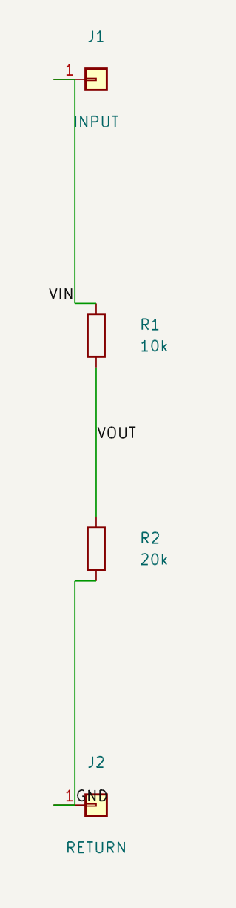
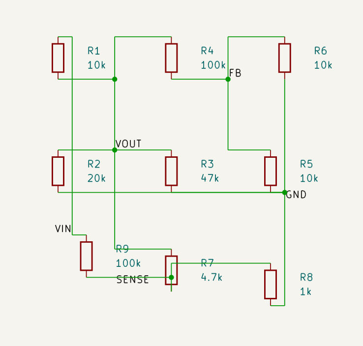
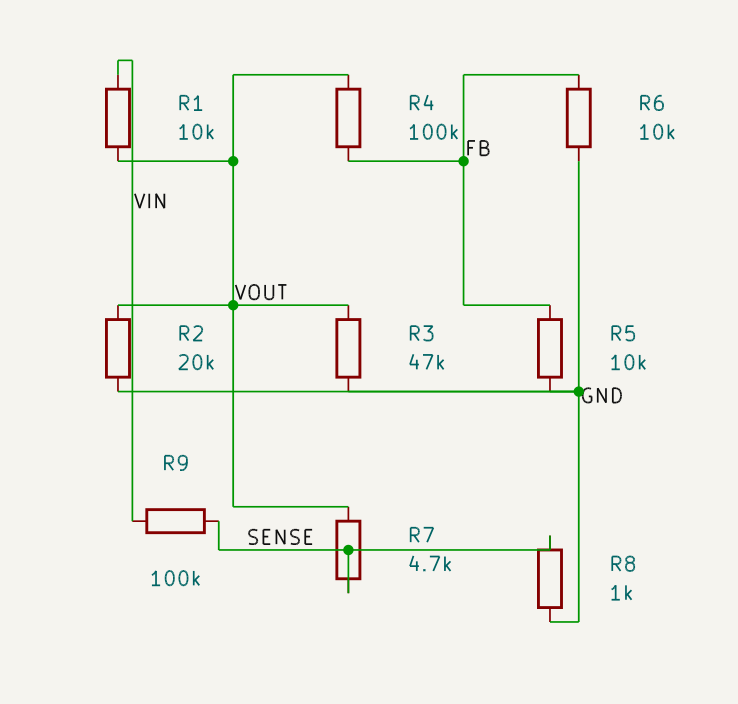

# PR #20 — revisão visual do divisor e do circuito denso

Revisão de 13/09/2026 sobre o commit `1b7b93882451623167de0363bc5df94b8d885523`.

**Resultado: orientação e preservação confirmadas; aprovação visual completa bloqueada.**
Não fazer merge com base apenas na CI verde: ainda há colisões de desenho.

As imagens abaixo são recortes dos SVGs exportados pelo KiCad 10 na CI, renderizados
com MuPDF. Não são desenhos reconstruídos a partir da topologia nem screenshots
obtidos no Windows do usuário. O aceite local no Eeschema continua pendente.

[Execução da CI](https://github.com/charlesmmorais/coppermind/actions/runs/34762660741)
— Python 3.11, Python 3.12 e integração KiCad passaram.
[Artefato flow-visual-review](https://github.com/charlesmmorais/coppermind/actions/runs/34762660741/artifacts/10319333003)
contém quatro `.kicad_sch`, quatro netlists reais, quatro SVGs e `comparison.json`.

## Resultados medidos

| Caso | Orientação | Fios antes → depois | Preservação | Revisão visual |
| --- | --- | --- | --- | --- |
| Divisor VIN/R1/VOUT/R2/GND | R1 e R2 a 0°, eixo vertical | 81,28 → 81,28 mm | J1/J2 e posições de R1/R2 mantidos | GND sobrepõe o corpo de J2 |
| Denso VIN/VOUT/FB/SENSE/GND, R1…R9 | R9 de 0° para 90° | 322,58 → 323,85 mm | R1…R8: posição, rotação e campos idênticos; R9 não se moveu | SENSE atravessa o corpo de R7 e coincide com a borda superior de R8 |

O baseline denso é o layout **após o reflow** do exemplo existente, antes de
`component_orient_flow(R9)`. Assim, a comparação isola o efeito da orientação.

As quatro rotações foram avaliadas. Para R9, o eixo preferido pelos centroides é
vertical, mas a candidata horizontal tem menor custo total: 167,894 → 141,224.
A penalização por colisão dos campos do alvo cai de 50,8 para zero. A troca custa
1,27 mm de fio e uma dobra adicional nas nets VIN/SENSE (78,74 → 80,01 mm).
Isso confirma a escolha por custo conjunto, sem garantir que todos os elementos
do esquema já tenham clearance visual suficiente.

## Divisor vertical



R1/R2 estão alinhados verticalmente. Reference e Value estão horizontais, ao lado
dos corpos. VOUT fica entre os resistores. O label GND, junto ao terminal inferior,
colide com o corpo de J2; esse resultado ainda não atende à regra de clearance dos labels.

## Circuito denso

Antes da orientação de R9:



Depois:



A rotação libera os campos de R9, antes atravessados por fios. Os demais componentes
continuam onde estavam. Entretanto, a net SENSE ainda atravessa o corpo de R7;
na imagem final a junction dessa net aparece dentro do corpo. O fio também segue
sobre a borda superior de R8. A colisão em R7 já estava presente no baseline e
não é eliminada pela orientação do alvo.

Esses contatos com desenhos dos corpos são problemas de representação: não são
crossings ortogonais comuns entre fios. A correção deve preservar a permissão de
crossings interior/interior sem junction e bloquear os contatos elétricos proibidos.

## Verificação elétrica e limites

- Exportação estrita antes/depois, `validation["blocking"] == false` e
  `semantic_violations == []`; nenhum `FOREIGN_PIN_GEOMETRY_CONTACT`.
- Netlists exportadas pelo KiCad antes/depois correspondem exatamente às nets e
  aos pinos declarados, inclusive VIN/SENSE de R9; nenhuma união elétrica acidental.
- CI confirmou os textos Reference horizontais nos SVGs reais; Reference/Value
  também foram inspecionados visualmente nas imagens acima.
- O ERC apresenta avisos `lib_symbol_issues` da configuração das tabelas de
  bibliotecas do runner, sem erros elétricos bloqueantes. Não foi um ERC sem avisos.
- O validador atual não torna essas colisões gráficas bloqueantes; CI verde não
  substitui o aceite visual.

Pendências concretas: afastar GND do corpo de J2 sem soltar o label da net;
rotear SENSE fora dos corpos de R7/R8, preservando os demais componentes;
repetir a comparação e o aceite local antes do merge.

## Reproduzir no Windows

Com o MCP atualizado e reiniciado usando o backend `memory`, execute em outro
PowerShell, na raiz do repositório:

```powershell
& .\.venv\Scripts\python.exe .\examples\flow_visual_validation_mcp.py
Invoke-Item .\flow_visual_validation\divider_after.kicad_sch
Invoke-Item .\flow_visual_validation\dense_before.kicad_sch
Invoke-Item .\flow_visual_validation\dense_after.kicad_sch
```

O script usa tools MCP semânticas e exportação incremental. A leitura das
coordenadas exportadas serve apenas para verificar preservação e comprimento;
não há criação manual de fios nem alteração da arquitetura do roteador.
